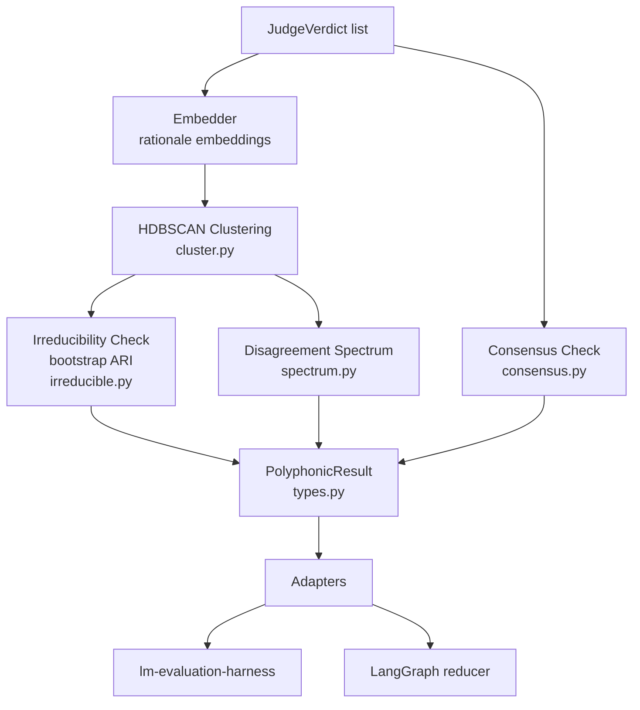

# polyphonic-eval

[](https://pypi.org/project/polyphonic-eval/)
[](https://pypi.org/project/polyphonic-eval/)
[](LICENSE)
[](https://github.com/hinanohart/polyphonic-eval/actions/workflows/ci.yml)

**Multi-judge LLM evaluation that doesn't collapse minority signal.**
Returns typed disagreement structure, plugs into `lm-evaluation-harness` and LangGraph.

When you ask 5 LLM judges to score an output and 3 say "good", 1 says "harmful", 1 says "factually wrong", a `mean` or `majority` reduction throws away two distinct concerns. `polyphonic-eval` preserves them as typed clusters and **refuses** scalar collapse by default — callers must explicitly opt in.

---

## Architecture



---

## Quickstart

```bash
pip install "polyphonic-eval[embed]"     # bundles the default sentence-transformers embedder
```

```python
from polyphonic_eval import aggregate, JudgeVerdict

verdicts = [
    JudgeVerdict(judge_id="gpt-4o",  score=0.9, rationale="Helpful and concise."),
    JudgeVerdict(judge_id="claude",  score=0.8, rationale="Useful answer."),
    JudgeVerdict(judge_id="gemini",  score=0.85, rationale="Good explanation."),
    JudgeVerdict(judge_id="llama",   score=0.2, rationale="Factually incorrect about X."),
    JudgeVerdict(judge_id="qwen",    score=0.1, rationale="Contains a safety concern."),
]

result = aggregate(verdicts, item_id="example-1")

print(result.consensus.has_consensus)         # False
print(result.disagreement.is_irreducible)     # True (embedder-dependent)
print(len(result.disagreement.clusters))      # 2-3 (good vs. factuality/safety)
print(result.disagreement_spectrum)           # ~0.6-0.8 (embedder-dependent)

# Explicit collapse (opt-in)
mean = result.to_scalar(policy="mean")        # 0.57
# float(result) raises TypeError — refusing scalar collapse is the point.
```

The cluster count and spectrum value depend on the embedding model. See the "Note on embedders" section below.

---

## How it works

1. **Embed rationales**: each judge's rationale text is embedded with a sentence embedder (default: `sentence-transformers/all-MiniLM-L6-v2`).
2. **Cluster with HDBSCAN**: rationale embeddings are clustered to find semantically distinct groups of judges. Noise points (HDBSCAN label `-1`) are gathered into a single "unclustered" cluster rather than inflating the cluster count.
3. **Bootstrap irreducibility check**: the cluster assignment is resampled N times and Adjusted Rand Index is computed. If the mean ARI exceeds the threshold (`0.6` by default), the disagreement is declared *irreducible* — the judge groups are structurally stable, not random variation.
4. **Compute disagreement spectrum**: a scalar in `[0, 1]` reflecting how spread apart the cluster centroids are in embedding space. Zero means judges clumped together; higher means distinct camps.
5. **Check consensus**: separately from clustering, a score-tolerance check identifies whether a quorum of judges agreed within a numeric band.
6. **Return `PolyphonicResult`**: a frozen Pydantic model holding all of the above. `__float__` is not implemented; `__bool__` is explicitly implemented to raise `TypeError` — both coercions are blocked, callers must inspect typed fields.

---

## Why it matters

RLHF/DPO training on multi-rater data routinely averages or majority-votes annotations, which:

- discards **minority rationales** that flag distinct failure modes
- collapses **safety concerns** into "outliers" of a single quality scalar
- hides **judge bias structure** that an ensemble could otherwise surface

`polyphonic-eval` keeps that structure intact. Use it in eval pipelines where you need to know **why** judges disagreed, not just **how much**.

References: Free-MAD (arXiv 2509.11035), DMAD (ICLR 2025), X-MAS (arXiv 2505.16997), sociolinguistic foundations of LM evaluation (arXiv 2407.09241).

---

## Installation

```bash
pip install "polyphonic-eval[embed]"         # recommended: bundles default embedder
pip install polyphonic-eval                  # bring-your-own embedder (must pass embedder= explicitly)
pip install "polyphonic-eval[langgraph]"     # + LangGraph adapter
pip install "polyphonic-eval[lm-eval]"       # + lm-evaluation-harness adapter
pip install "polyphonic-eval[all]"           # everything
```

**Note on embedders**: the clustering result depends on the embedding model. The default is a lazy `sentence-transformers/all-MiniLM-L6-v2` wrapper. For reproducible eval pipelines, **pin a specific embedder** by passing `cluster_fn` or `embedder` to `aggregate()`. See `docs/design/0003-embedder-protocol.md`.

---

## Adapters

### `lm-evaluation-harness`

```yaml
# config snippet
metric_list:
  - metric: !function polyphonic_eval.adapters.lm_eval.polyphonic_metric
    aggregation: !function polyphonic_eval.adapters.lm_eval.aggregate_polyphonic
    higher_is_better: true
```

### LangGraph reducer

```python
from polyphonic_eval.adapters.langgraph import polyphonic_reducer

class JuryState(TypedDict):
    verdicts: Annotated[list[JudgeVerdict], polyphonic_reducer]
```

The reducer keeps every judge's vote typed; consumers see a `PolyphonicResult` at read-time.

---

## Key types

| Type | Description |
|---|---|
| `JudgeVerdict` | One judge's score, label, rationale, and optional confidence |
| `PolyphonicResult` | Frozen aggregate: consensus + disagreement + spectrum |
| `IrreducibleDisagreement` | Cluster structure + bootstrap stability flag |
| `DisagreementCluster` | A group of judges with semantically similar rationales |
| `ConsensusClaim` | Whether a quorum agreed within score tolerance |
| `AggregatorConfig` | Tunable thresholds (ARI threshold, min cluster size, etc.) |

---

## Background

The package name nods to Mikhail Bakhtin's *polyphony* — a literary-critical observation that some texts hold multiple unresolved voices instead of collapsing them. The connection is intentional but is **not** load-bearing for use: every public function name uses ordinary disagreement/consensus/cluster vocabulary. See `docs/theory.md` if you want the longer story.

---

## License

MIT. See `LICENSE`.
